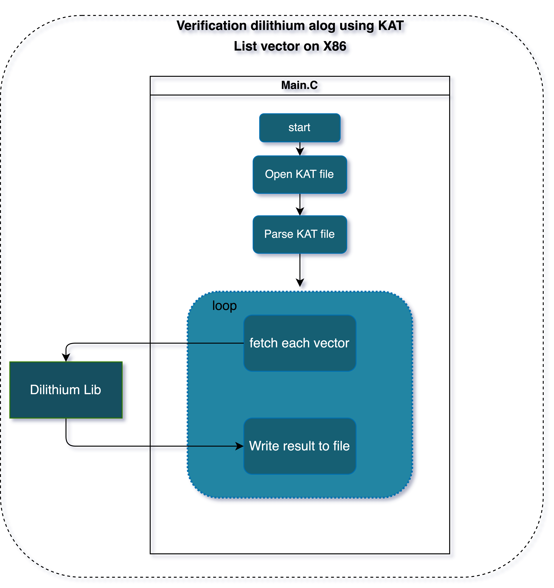

# ReadMe

## Validation of Dilithium algo on x86 machine using KAT file

### This document describes how we can test Dilithium Algorithm on a x86 machine using KAT file

Test suite indirectly also test sha3-512 as Dilithium uses it internally

### Flow-Diagram


### Level 1:
Test with KAT (Known Answer Test) vectors.
main.c expects two arguments: input_file (KAT file) and output_file (result).
The make command (build) will generate an executable file named dilithium.

* **Path**: `security/algo/crypto/test/`
* **To build**:
    * `make`
        * rebuild: `make -B`
        * clean  : `make clean`
        * build  : `make dilithium` (another way of build)

* **To run**:
    * `./dilithium -t KAT/PQCsignKAT_4896.rsp outputKatRsp.txt`

* **Help**:
    * `./dilithium -h`
        * ```
            ./dilithium -h
            Usage: ./dilithium [-t input_file output_file] [-r iterations output_file] [-h]
            This program validate the signature content of <input_file>(KAT file) using dilithium algo and write result to output file <output_file>

            positional arguments:
                -t input_file output_file         Validate the given KAT file and result will be in output_file
                    Optional arg - output_file
                -r iterations output_file         Execute random test vector (i.e with known pub key but random message hash and signature)
                    Optional arg - output_file
                    Max iterations accepted: 4,29,49,67,295

            Optional Arguments:
            -h                                  Print this help message.

            Example:
            ./dilithium -t input.txt output.txt
            ./dilithium -r 1000 random_output.txt```

### Level 2:
Test with random test vector (i.e with known pub key but random
message hash and signature)

* **To build**:
    * `make`
        * rebuild: `make -B`
        * clean  : `make clean`
        * build  : `make dilithium` (another way of build)

* **To run**:
    * `./dilithium -r 10000 randomOutputRsp.txt`
